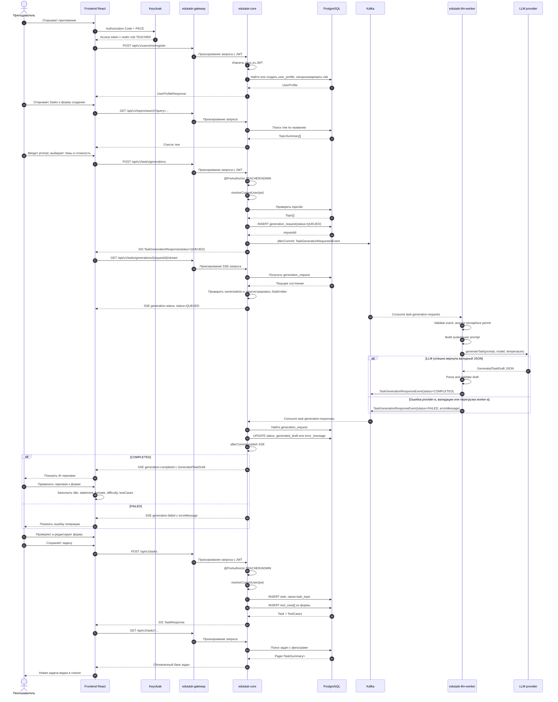

## Sequence diagram: teacher task generation flow

Поток студенческого решения задач реализован отдельно через `CodeSubmissionController`, Kafka `code-submission-*`, 
`edutask-judge-worker` и Judge0. В этой диаграмме он не является основным, потому что фокус - преподавательское 
создание задания.